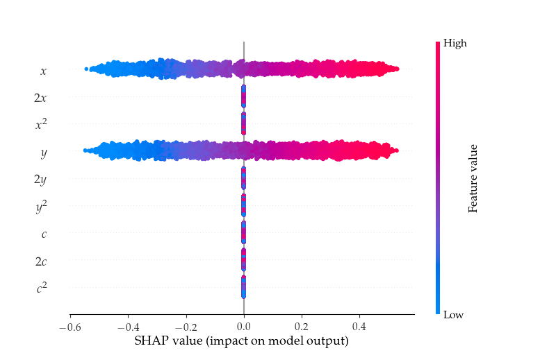
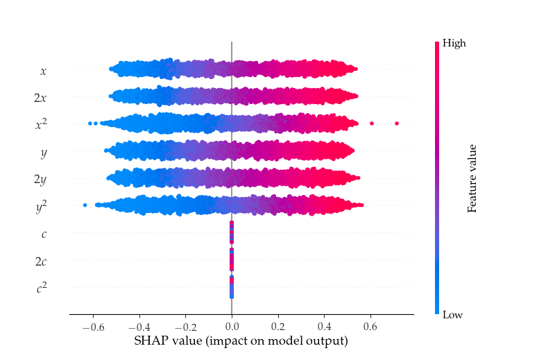

# DisentanglingInfluence

This repository contains the code from our [2019 paper](https://arxiv.org/abs/1906.08652) on indirect influence audits. We leverage disentangled representations to capture indirect influence on both individual and aggregate model predictions. Please see our paper for an explanation of our methods.

 

Above: Direct (left) and indirect (right) influence distributions in a synthetic example where a model learns to predict label x+y given independent features x, y, and c. Unlike direct influence audits, indirect influence captures that features such as 2x and 2y influence the prediction as proxy variables for x and y.

## Installation

* If you don't already have python3, you can install the current version from [here](https://www.python.org/downloads/).
* Navigate to the directory where you would like to download the package and run the command:

`$ git clone https://github.com/charliemarx/disentangling-influence`
* Navigate to the top directory and run the following commands:  
```
$ python setup.py
$ pip install -r requirements.txt
```
* To run experiments with the dSprites dataset you will need to clone the [dSprites dataset github repository](https://github.com/deepmind/dsprites-dataset) into `DisentanglingInfluence/data/dsprites/dsprites-dataset`. You can do this by navigating to `DisentanglingInfluence/data/dsprites/` then running the command:

`$ git clone https://github.com/deepmind/dsprites-dataset`

## Usage

Scripts to run our experiments are in the `DisentanglingInfluence/scripts` directory. Output files are saved to the `outputs/<experiment_name>_test` directory. 

